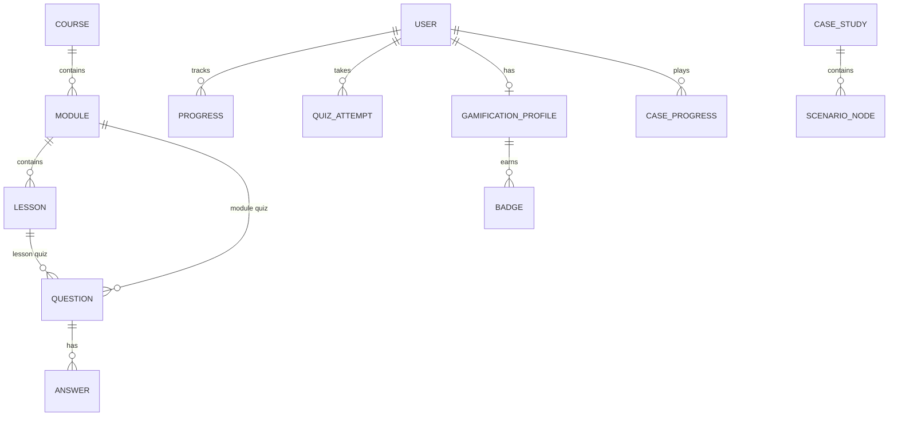

# EDO LMS — Ijro.uz O'quv Platformasi

Professional o'quv platformasi davlat xodimlari uchun **Edo.ijro.uz** (Elektron Hujjat Aylanishi) tizimida ishlashni o'rgatish uchun. Django 5.x backend va zamonaviy interaktiv UI bilan qurilgan.

[](https://www.djangoproject.com/)
[](https://www.python.org/)
[]()

---

## 🚀 Asosiy Funksiyalar

### 📚 O'quv Tizimi
- **Structured Learning Path**: Kurs → Dars → Mavzu ierarxiyasi
- **Multimedia Content**: Matn, video, skrinshotlar bilan boy kontentlar
- **Interactive Quizzes**: Har bir mavzu uchun 20 ta test savoli
- **Progress Tracking**: Real-time o'zlashtirish monitoring
- **Max Attempts**: Urinishlar soni cheklash (default: 6)

### 🎮 Gamifikatsiya Tizimi (NEW!)
- **XP System**: Darslar (10 XP) va testlar (20-50 XP) uchun ballar
- **Streak Tracking**: Kunlik faollik zanjiri (Duolingo-style)
- **Badges & Achievements**: Avtomatik yutuqlar va nishonlar
- **Leaderboard**: Foydalanuvchilar reytingi
- **Activity Analytics**: To'liq user action tracking

### 📝 Interactive Case Studies (NEW!)
- **Decision Trees**: Hayotiy ssenariylar bo'yicha qaror qabul qilish
- **Graph Navigation**: Shoxlanuvchi holat o'tishlari
- **XP Rewards**: To'g'ri qarorlar uchun ball
- **Realistic Scenarios**: Haqiqiy davlat idoralari vaziyatlari

### 🎯 Interactive Simulator (NEW!)
- **Virtual Sandbox**: Edo.ijro.uz interfeys simulyatori
- **Step-by-Step Workflows**: Bosqichma-bosqich amaliy mashqlar
- **Progress Tracking**: Simulyator o'zlashtirish monitoring

### 🖨️ PDF Cheat Sheets (NEW!)
- **Professional PDFs**: ReportLab bilan A4 formatda
- **Brand Design**: Indigo ranglar va vizual elementlar
- **4 Modules**: Kiruvchi, Chiquvchi, Ichki, Ijro bo'yicha
- **Download System**: 100% completion uchun yuklab olish

### 🎨 Professional Admin Panel (NEW!)
- **Hierarchical Filtering**: Kurs → Dars → Mavzu navigatsiya
- **Color-Coded Indicators**: Savol sifati vizual ko'rsatkichlari
- **Question Count Display**: Har bir mavzu uchun savol statistikasi
- **Performance Optimized**: N+1 query muammosi hal qilindi
- **Uzbek Language**: O'zbekcha interface

---

## 🛠 Texnologiyalar

### Backend
- **Django 5.2** - Web framework
- **Django REST Framework** - API endpoints
- **PostgreSQL / SQLite** - Database
- **Django Signals** - Event-driven architecture

### Frontend
- **Django Templates** - Server-side rendering
- **Tailwind CSS** - Utility-first CSS framework
- **Alpine.js** - Minimal JavaScript framework
- **Bootstrap 5** - UI components

### Tools & Libraries
- **ReportLab** - PDF generation
- **Pytest** - Testing framework
- **Ruff** - Python linter & formatter
- **Pillow** - Image processing

---

## 📐 Arxitektura

### Database Schema



### Apps Structure

```
edo/
├── accounts/          # User authentication
├── courses/           # Courses, modules, lessons
│   └── services/      # PDF generation
├── quizzes/           # Questions, answers, attempts
├── progress/          # Learning progress tracking
├── gamification/      # XP, badges, leaderboard
├── case_studies/      # Interactive scenarios
├── simulator/         # Edo.ijro.uz sandbox
├── core/              # Shared utilities
│   └── logging_setup.py
├── api/               # REST API endpoints
└── config/            # Settings & URLs
```

---

## 💿 O'rnatish (Installation)

### 1. Repository ni klonlash

```bash
git clone https://github.com/Valijon21/edo_lms_app.git
cd edo_lms_app
```

### 2. Virtual environment yaratish

```bash
# Virtual muhitni yaratish
python -m venv .venv

# Faollashtirish (Windows)
.venv\Scripts\activate

# Faollashtirish (Linux/macOS)
source .venv/bin/activate
```

### 3. Dependencies o'rnatish

```bash
pip install -r requirements.txt
```

### 4. Environment o'zgaruvchilarini sozlash

**MUHIM**: `.env` fayli hech qachon git'ga commit qilinmasligi kerak!

```bash
# Windows
copy .env.example .env

# Linux/macOS
cp .env.example .env
```

`.env` faylini ochib, quyidagi qiymatlarni kiriting:

```env
# Django SECRET_KEY yaratish:
# python -c "from django.core.management.utils import get_random_secret_key; print(get_random_secret_key())"
SECRET_KEY=your-generated-secret-key-here

# Development uchun:
DEBUG=True
ALLOWED_HOSTS=localhost,127.0.0.1

# SQLite ishlatish (tavsiya etiladi dev uchun):
USE_POSTGRES=False

# PostgreSQL ishlatish:
# USE_POSTGRES=True
# DB_NAME=edo_app
# DB_USER=your_username
# DB_PASSWORD=your_password
# DB_HOST=localhost
# DB_PORT=5432
```

**Security Best Practices:**
- ✅ `.env` faylini `.gitignore` da tekshiring
- ✅ Har bir development environment uchun alohida `.env`
- ✅ Production uchun kuchli SECRET_KEY generate qiling
- ❌ Hech qachon `.env` ni git'ga commit qilmang
- ❌ Hech qachon SECRET_KEY ni share qilmang

### 5. Database migratsiyalari

```bash
# Migratsiyalarni qo'llash
python manage.py migrate

# Superuser yaratish
python manage.py createsuperuser
```

### 6. Seed Data yuklash

```bash
# Kurslar, darslar va 80 ta test savolini yuklash
python seed_lessons.py

# Case studies yuklash
python manage.py seed_cases

# Simulator scenarios yuklash
python manage.py seed_simulator

# Gamification badges yaratish (avtomatik migrations orqali)
```

### 7. Serverni ishga tushirish

```bash
python manage.py runserver
```

**URLs:**
- 🏠 Bosh sahifa: http://127.0.0.1:8000/
- 🔐 Admin panel: http://127.0.0.1:8000/admin/
- ℹ️ Platform info: http://127.0.0.1:8000/info/
- 📚 Courses: http://127.0.0.1:8000/courses/
- 🎮 Gamification API: http://127.0.0.1:8000/gamification/profile/
- 📝 Case Studies API: http://127.0.0.1:8000/case-studies/list/
- 🎯 Simulator: http://127.0.0.1:8000/simulator/

---

## 🧪 Testing

### Run Tests

```bash
# Barcha testlarni ishga tushirish
pytest

# Verbose mode
pytest -v

# Specific test file
pytest tests/test_gamification_and_cases.py

# Coverage report
pytest --cov=. --cov-report=html
```

### Code Quality

```bash
# Linter tekshirish
ruff check .

# Auto-fix
ruff check . --fix

# Format code
ruff format .

# Format check only
ruff format . --check
```

---

## � Admin Panel Usage

### Professional Features

#### Question Admin (`/admin/quizzes/question/`)
1. **Hierarchical Filtering**: Kurs → Dars → Mavzu
2. **Question Count**: Har bir mavzu uchun savol soni
3. **Color Indicators**:
   - 🟢 Green: 4+ javob (yaxshi)
   - 🟠 Orange: 2-3 javob (qoniqarli)
   - � Red: 0-1 javob (kam)
4. **To'g'ri javob tekshiruvi**: ✓ yoki ✗
5. **Performance**: Optimized queries

#### Statistics Command

```bash
python manage.py check_admin_improvements
```

Output:
```
📚 Total Courses: 1
  ├─ Module: 1-Dars (320 ta savol)
  │  └─ Lesson: Kiruvchi hujjatlar (20 ta savol) ✓
✓ All lessons have 20+ questions!
```

---

## 📊 Features Documentation

### Gamification System

#### XP Rewards
- Darsni tugatish: **10 XP**
- Lesson testidan o'tish: **20 XP**
- Modul testidan o'tish: **50 XP**
- Case study yakunlash: **50 XP**

#### Streak Tracking
- Har kuni tizimga kirish va bitta dars o'qish
- Streak uzilsa, 1 ga qaytadi
- Longest streak saqlanadi

#### Badges
- **Tezkor O'rganuvchi**: 100 XP to'plash
- **3 Kunlik Streak**: Ketma-ket 3 kun faol
- **7 Kunlik Streak**: Ketma-ket 7 kun faol

### Case Studies

Decision tree ssenariylar:
1. Boshlang'ich holat (start_node)
2. Tanlov variantlari (edges)
3. Keyingi holat (next node)
4. XP delta (+/- ball)
5. Tugash (end_node yoki fail_node)

### PDF Cheat Sheets

4 ta modul uchun:
- **Kiruvchi**: Kiruvchi hujjatlarni qabul qilish
- **Chiquvchi**: Chiquvchi xat jo'natish
- **Ichki**: Ichki buyruqlar yaratish
- **Ijro**: Ijro intizomi nazorati

---

## 🚀 Production Deployment

### Environment Variables

```env
# Production settings
SECRET_KEY=your-super-secret-production-key
DEBUG=False
ALLOWED_HOSTS=yourdomain.com,www.yourdomain.com

# PostgreSQL (required for production)
USE_POSTGRES=True
DB_NAME=edo_production
DB_USER=edo_user
DB_PASSWORD=strong_password_here
DB_HOST=your_db_host
DB_PORT=5432

# Security
SECURE_SSL_REDIRECT=True
SESSION_COOKIE_SECURE=True
CSRF_COOKIE_SECURE=True
```

### Static Files

```bash
# Collect static files
python manage.py collectstatic --noinput
```

### Gunicorn (WSGI Server)

```bash
gunicorn config.wsgi:application --bind 0.0.0.0:8000 --workers 4
```

---

## 📝 Changelog

### Version 1.2.0 (Latest)

#### 🎮 Gamification System
- Complete XP and streak tracking
- Badge awards with auto-unlock
- Leaderboard with rankings
- Activity logging via Django signals

#### 📝 Interactive Case Studies
- Decision tree implementation
- Graph-based navigation
- User progress tracking
- XP integration

#### 🎯 Simulator
- Virtual Edo.ijro.uz sandbox
- Step-by-step workflows
- Progress monitoring

#### 🖨️ PDF Cheat Sheets
- Professional ReportLab generator
- 4 module contents
- Brand-colored A4 format

#### 🎨 Professional Admin
- Hierarchical filtering
- Color-coded indicators
- Performance optimization
- Uzbek language support

#### 🔒 Security
- Removed .env from git
- Added .env.example template
- Updated security documentation

See [CHANGELOG.md](CHANGELOG.md) for full history.

---

## 🤝 Contributing

Bu loyiha hozircha private repository. Contribute qilish uchun:

1. Feature branch yarating: `git checkout -b feature/amazing-feature`
2. O'zgarishlarni commit qiling: `git commit -m 'feat: Add amazing feature'`
3. Branch'ni push qiling: `git push origin feature/amazing-feature`
4. Pull Request oching

### Commit Message Convention

```
feat: Add new feature
fix: Bug fix
docs: Documentation update
style: Code style changes
refactor: Code refactoring
test: Add tests
chore: Maintenance tasks
```

---

## 📄 License

Private project - All rights reserved.

---

## 👥 Authors

- **Valijon** - Project Owner
- **Kiro AI** - Professional Development Assistant

---

## 🙏 Acknowledgments

- Django Framework
- Tailwind CSS
- ReportLab
- O'zbekiston Respublikasi Davlat Idoralari

---

## 📞 Support

Agar savol yoki muammo bo'lsa:
- GitHub Issues: [Create Issue](https://github.com/Valijon21/edo_lms_app/issues)
- Documentation: `quizzes/ADMIN_GUIDE.md`

---

**Made with ❤️ for O'zbekiston Davlat Xodimlari**
