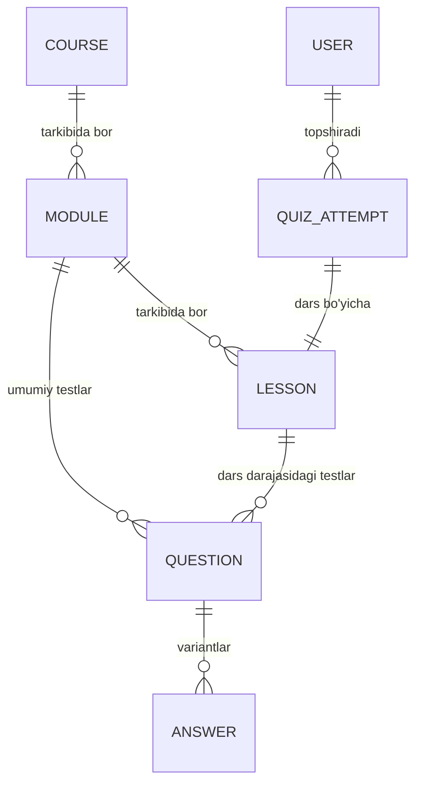

# EDO LMS — Ijro.uz O'quv Platformasi

EDO LMS — yangi ishga kirgan xodimlarga **Ijro.uz** (Elektron Hujjat Aylanishi) tizimida ishlashni mukammal va professional darajada o'rgatuvchi zamonaviy o'quv platformasi. Tizim Django 5.x backend va premium dizaynlashtirilgan interaktiv shablonlar asosida qurilgan.

---

## 🚀 Loyihaning Asosiy Imkoniyatlari

- **Darslar va Mavzular**: Har bir modul va mavzu bo'yicha vizual kontentlar (matnli tushuntirishlar, tizimdan bosqichma-bosqich skrinshotlar va video darslar).
- **Mavzu Darajasidagi Testlar (Lesson-Level Quizzes)**: Har bir dars (mavzu) bo'yicha alohida bilimni sinash testlari.
- **Urinishlar Cheklovi (`max_attempts`)**: Modul yoki dars darajasida foydalanuvchilar uchun test topshirish urinishlarini cheklash funksiyasi.
- **O'zlashtirish va Progress Monitoring**: Foydalanuvchining darslarni o'zlashtirish va test natijalariga qarab dinamik progressini hisoblash tizimi.
- **Platforma Haqida Ma'lumot Sahifasi**: Tizim integratsiyalari (Pm.gov.uz, E-qaror, hrm.argos.uz, Edo.ijro.uz) va ularning vazifalari haqida interaktiv, premium UI dizaynli ma'lumotlar paneli.

---

## 🛠 Texnologiyalar Staki

* **Backend**: Django 5.x, Django REST Framework (DRF)
* **Frontend**: Django Templates, Tailwind CSS (Play CDN orqali premium UI/UX animatsiyalar bilan)
* **Ma'lumotlar bazasi**: SQLite (Tahlil va dev uchun), PostgreSQL (Production uchun tayyor)
* **Avtomatlashtirish**: Python 3.12 (faster-whisper, PyAV, opencv-python transkript va kadrlar yaratish uchun)
* **Kod Sifati**: Ruff (Linter & Formatter)
* **Testlash**: Pytest

---

## 📐 Tizim Arxitekturasi va MB Strukturasi

Ma'lumotlar bazasi modellari quyidagi tuzilishga ega:



### So'nggi Arxitekturaviy O'zgarishlar (Database Migrations)
1. **Dars Darajasidagi Testlar**: `Question` va `QuizAttempt` modellariga `lesson` (`ForeignKey` -> `Lesson`) maydoni qo'shildi. Bu orqali testlarni umumiy modul uchun emas, balki har bir dars uchun alohida tashkil etish imkoniyati yaratildi.
2. **Urinishlar Cheklovi**: `Module` va `Lesson` modellariga `max_attempts` (`PositiveIntegerField`) ustuni qo'shildi. Urinishlar soni cheklovi admin panel orqali oson boshqariladi.

---

## 💿 O'rnatish va Ishga Tushirish (Development)

Loyiha mahalliy muhitda quyidagi ketma-ketlikda ishga tushiriladi:

### 1. Virtual muhit va Kutubxonalar
```bash
# Repozitoriyani klonlash
git clone https://github.com/Valijon21/edo_lms_app.git
cd edo_lms_app

# Virtual muhitni yaratish va faollashtirish
python -m venv .venv
# Windows uchun:
.venv\Scripts\activate
# Linux/macOS uchun:
source .venv/bin/activate

# Kerakli kutubxonalarni yuklash
pip install -r requirements.txt
```

### 2. Atrof-muhit o'zgaruvchilari (Environment Variables)
`.env.example` faylidan nusxa olib, `.env` faylini yarating va kerakli sozlamalarni kiriting:
```bash
cp .env.example .env
```

### 3. Migratsiyalar va Ma'lumotlarni Seed Qilish
Baza tuzilmasini yaratish va uni boshlang'ich professional o'quv darslari hamda 80 ta test savollari bilan to'ldirish uchun maxsus scriptni ishga tushiramiz:
```bash
# Migratsiyalarni qo'llash
python manage.py migrate

# Darslar va testlarni bazaga yuklash (seeding)
python seed_lessons.py
```
*Eslatma: `seed_lessons.py` skripti tizimga premium matnlar, bosqichma-bosqich rasm ketma-ketliklari va har bir mavzu bo'yicha 20 tadan (jami 80 ta) test savollarini avtomatik yozadi.*

### 4. Admin yaratish va Serverni ishga tushirish
```bash
# Superuser (Administrator) yaratish
python manage.py createsuperuser

# Serverni boshlash
python manage.py runserver
```

* **Bosh sahifa**: `http://127.0.0.1:8000/`
* **Admin panel**: `http://127.0.0.1:8000/admin/`
* **Platforma haqida ma'lumot sahifasi**: `http://127.0.0.1:8000/info/`

---

## 🧪 Sifat va Testlash (Testing)

Loyihaning test tizimi pytest va ruff vositalari yordamida avtomatlashtirilgan.

### Testlarni ishga tushirish:
```bash
pytest
```

### Linter va Formatterni tekshirish:
```bash
ruff check .
ruff format . --check
```

---

## 📝 So'nggi Amalga Oshirilgan Ishlar (Changelog)

### 🚀 Darslar va Testlar Tizimini Yangilash (Milestone 1)
* `Question` va `QuizAttempt` modellariga `lesson` maydoni qo'shildi va `courses/models.py` hamda `quizzes/models.py` da mos o'zgarishlar amalga oshirildi.
* `max_attempts` maydoni qo'shilib, urinishlar soni 6 tadan oshib ketganda foydalanuvchiga taqiq qo'yish mantiqi `quizzes/views.py` va `progress` hisoblash servisi doirasida qayta yozildi.
* `seed_lessons.py` yangilanib, 80 tadan ortiq test savollari (javob variantlari, to'g'ri/noto'g'ri kalitlar bilan) bazaga kiritildi.
* Kurs darslari interfeysi yangi Tailwind elementlari va dinamik vizual navigatsiya panellari yordamida to'liq modernizatsiya qilindi.

### ℹ️ Platformalar haqida ma'lumot sahifasi (Milestone 2)
* Yangi premium `PlatformInfoView` controlleri yaratilib, `/info/` yo'li orqali bog'landi.
* `templates/core/platform_info.html` shabloni orqali foydalanuvchilarga Edo.ijro.uz, Pm.gov.uz va boshqa davlat idoralari portallarining bir-biri bilan integratsiyalashuv bosqichlari to'liq, interaktiv grafik ko'rinishida taqdim etildi.
* Tizimning bosh sahifasi va navigatsiya paneli (navbar) orqali ushbu yangi sahifaga silliq yo'naltirish havolalari o'rnatildi.
